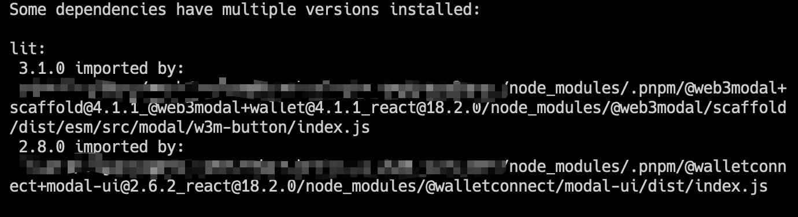

# webpack-plugin-deps-analyzer

用于做依赖项的整理优化

## feature

- 收集所有参与编译的文件
- 查看参与编译的依赖版本
- 查找多个版本的依赖
- 查看依赖参与编译的文件个数

## usage

```js
import DepsAnalyzer from "webpack-plugin-deps-analyzer";

const webpackConfig = {
  plugins: [
    new DepsAnalyzer({
      outDir: output,
      verbose: true,
    }),
  ],
};
```

## 配置项

```ts
export interface Options {
  /**
   * json 文件输出路径
   */
  outDir?: string;
  /**
   * 是否打印日志
   * @default true
   */
  verbose?: boolean;
}
```

## 输出 json 文件示例

```json
{
  "deps": {
    "@adraffy/ens-normalize": ["1.10.1"],
    "@coinbase/wallet-sdk": ["3.9.1"],
    "@lit/reactive-element": ["1.6.3", "2.0.4"]
  },
  "files": {
    "@adraffy/ens-normalize@1.10.1": [
      "/projectRoot/node_modules/.pnpm/@adraffy+ens-normalize@1.10.1/node_modules/@adraffy/ens-normalize/dist/index.mjs"
    ],
    "@coinbase/wallet-sdk@3.9.1": [
      "/projectRoot/node_modules/.pnpm/@coinbase+wallet-sdk@3.9.1/node_modules/@coinbase/wallet-sdk/dist/assets/wallet-logo.js",
      "/projectRoot/node_modules/.pnpm/@coinbase+wallet-sdk@3.9.1/node_modules/@coinbase/wallet-sdk/dist/CoinbaseWalletSDK.js",
      "/projectRoot/node_modules/.pnpm/@coinbase+wallet-sdk@3.9.1/node_modules/@coinbase/wallet-sdk/dist/core/constants.js",
      "/projectRoot/node_modules/.pnpm/@coinbase+wallet-sdk@3.9.1/node_modules/@coinbase/wallet-sdk/dist/core/error/constants.js",
      "/projectRoot/node_modules/.pnpm/@coinbase+wallet-sdk@3.9.1/node_modules/@coinbase/wallet-sdk/dist/core/error/errors.js",
      "/projectRoot/node_modules/.pnpm/@coinbase+wallet-sdk@3.9.1/node_modules/@coinbase/wallet-sdk/dist/core/error/index.js"
    ]
  },
  "issuer": {
    "@adraffy/ens-normalize@1.10.1": "/projectRoot/node_modules/.pnpm/ethers@6.11.1/node_modules/ethers/lib.esm/hash/namehash.js",
    "@coinbase/wallet-sdk@3.9.1": "/projectRoot/node_modules/.pnpm/@web3modal+ethers@4.1.1_@web3modal+wallet@4.1.1_ethers@6.11.1_typescript@5.4.3/node_modules/@web3modal/ethers/dist/esm/src/utils/defaultConfig.js",
    "@lit/reactive-element@1.6.3": "/projectRoot/node_modules/.pnpm/lit@2.8.0/node_modules/lit/index.js",
    "@lit/reactive-element@2.0.4": "/projectRoot/node_modules/.pnpm/lit@3.1.0/node_modules/lit/index.js"
  }
}
```

## 打印 log 示例

